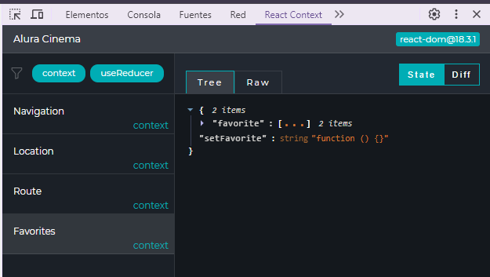

# 
ALURA CINEMA

 

+ ✔️ **Curso de React: practicando React con JS.**

## Creación de proyecto
Ejecutar el comando:

    npm create vite@latest

Nombre: 
    
    alura-cinema

Seleccionar:

    React
    JavaScript
Ejecutar:

    cd alura-cinema
    npm install
    npm rin dev

### Opcional
En el script del package.json se agrega `start` 

        "scripts": {
        "start": "vite",
        "dev": "vite",
        },

Se ejecuta el proyecto con:

     npm start
Inicia el proyecto en [http://localhost:5173/](http://localhost:5173/) 

## Fuentes
Se utiliza la familia de fuentes **Montserrat** traida desde [Google Fonts](https://fonts.google.com/specimen/Montserrat?query=mon) y se agrega en el **index.html**.

##  Instalación
Ejecutar el comando:

    npm i react-router-dom

[react-router-dom](https://www.npmjs.com/package/react-router-dom) es una dependecia de react que se utiliza para trabajar con las rutas.

## Opcional
Instalar [react-icons](https://react-icons.github.io/react-icons/search/#q=MdFavorite)

    npm install react-icons

Realizar la importación:

    import { MdFavorite, MdFavoriteBorder } from "react-icons/md";

## Uso de un servidor falso
    https://my-json-server.typicode.com/Mariq12/alura-cinema-api/videos

Repositorio en [GitHub](https://github.com/Mariq12/alura-cinema-api) de la API.
## Herramientas
Uso de la extensión [React Context DevTool](https://chromewebstore.google.com/detail/react-context-devtool/oddhnidmicpefilikhgeagedibnefkcf?hl=es). Es una herramienta de depuración para React Context y useReducer API

